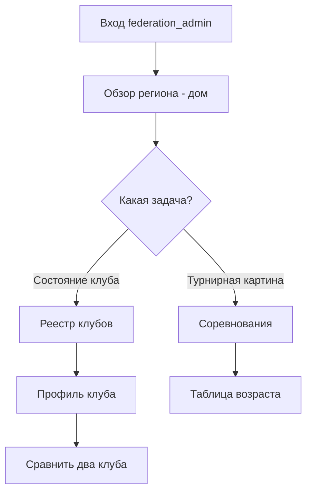
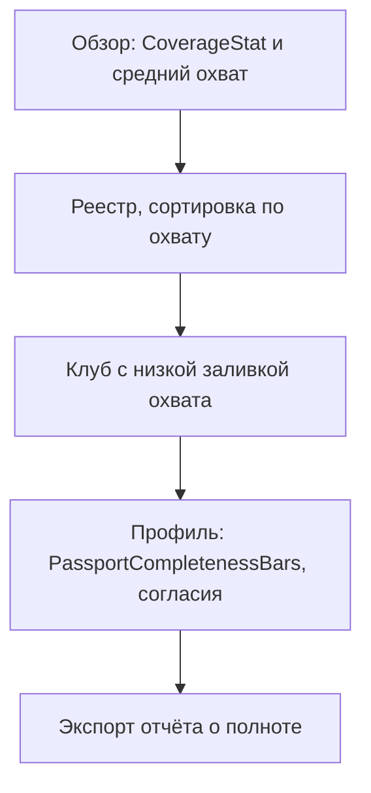

---
stepsCompleted:
  - step-01-init
  - step-02-discovery
  - step-03-core-experience
  - step-04-emotional-response
  - step-05-inspiration
  - step-06-design-system
  - step-07-defining-experience
  - step-08-visual-foundation
  - step-09-design-directions
  - step-10-user-journeys
  - step-11-component-strategy
  - step-12-ux-patterns
  - step-13-responsive-accessibility
  - step-14-complete
lastStep: 14
inputDocuments:
  - docs/bmad/PRD.md
  - DESIGN.md
  - PRODUCT.md
  - CLAUDE.md
  - docs/FEDERATION_DASHBOARD_UX.md
workflowType: 'ux-design'
projectName: 'Дашборд федерации региона (Clubs · Avandata)'
---

# UX Design Specification — Дашборд федерации региона (Clubs · Avandata)

**Author:** Дмитрий
**Date:** 2026-06-15

> Спецификация наследует существующую дизайн-систему проекта (`DESIGN.md`, `PRODUCT.md`): тёмная тема, CSS-токены, готовая библиотека компонентов. Здесь — как эта система применяется к кабинету федерации.

---

## 1. Резюме проекта

### Видение продукта

Кабинет регулятора, где детско-юношеский футбол региона виден как единая сопоставимая картина. Не витрина данных — **инструмент решений**: каждый экран ведёт к действию федерации (допуск, контроль честности, ресурс, отбор), а не к голой цифре.

### Целевые пользователи

Одна роль доступа `federation_admin`, но четыре «шляпы»:
- **Руководитель** (Сергей) — одна сопоставимая цифра для решения и отчёта в РФС/МРО.
- **Спортивный директор/скаут** (Андрей) — таланты против пула региона (Фаза 2).
- **Методист** (Елена) — качество клубов, возрастной эффект (Фаза 2–3).
- **Администратор ФФСПб** (Ольга) — реестр, членство, согласия, охват.

### Ключевые UX-вызовы

1. **Честный охват** — открытый слой (все клубы) и глубокий (paid-подписчики) нельзя складывать без подписи; «5 из 12» должно читаться как сила, не как «пусто».
2. **Обезличенный режим** — именные данные ребёнка только при `data_consent`; без согласия игрок вносит вклад в агрегаты, но без имени/фото.
3. **Четыре «шляпы» в одной роли** — обзор-«дом» должен разводить пользователей по их задачам за 1 клик.
4. **Read-only** — нет создающих действий; акцент интерфейса смещён с CTA на навигацию, сравнение и экспорт.

### Возможности дизайна

- Превратить «честный охват» в фирменный паттерн доверия (никто в детском футболе так не делает).
- Региональная нормировка как «вау-момент»: клуб/игрок против всего региона.
- Переиспользование зрелой клубной библиотеки → скорость и консистентность из коробки.

## 2. Эмоциональный отклик

Целевая эмоция — **спокойная уверенность**, не азарт и не тревога. Пользователь (часто вечером, при искусственном свете, в рабочем фокусе — сцена из `PRODUCT.md`) должен чувствовать: «я вижу регион целиком и решаю по данным». Тёмная тема оправдана: плотные данные читаются долго, тёмный фон снижает усталость и делает цветные акценты заметнее. Анти-эмоции: перегруз, ощущение слежки (важно для контекста «регулятор смотрит на клубы»), ощущение пустоты при неполном охвате.

## 3. UX-вдохновение и паттерны

- **Спорт-аналитика (Opta / StatsBomb-стиль)**, уже адаптированная в проекте (on-brand SVG/flex): beeswarm, scatter, heatmap — переносятся на уровень региона.
- **Федеративные дашборды** (UEFA benchmarking, EPPP-отчёты) — рэнкинги и сравнения как ядро ценности.
- **Собственная клубная система** — главный источник: те же карточки, та же сетка, тот же голос. Федерация ощущается как «этаж выше» того же здания, а не чужой продукт.
- Принцип из `PRODUCT.md`: **«число спокойное, смысл — в обрамлении»** (delta-чип, рамка, тинт), не перекраска цифры.

## 4. Основа дизайн-системы

### Выбор

**Существующая кастомная тёмная дизайн-система проекта** (`frontend/src/styles/index.css` + библиотека в `DESIGN.md`). Новый внешний UI-фреймворк не вводим.

### Обоснование

- Brownfield: кабинет федерации живёт в той же кодовой базе (React 19 + Vite), что и клубный.
- Консистентность и скорость: десятки готовых компонентов, токены, паттерны доступности уже есть.
- Бренд-гибкость: white-label через `tenants.brand` → федерация задаёт свою шапку/акцент, не ломая систему.

### Подход к реализации

Новые экраны (`frontend/src/routes/federation/*`) собираются из существующих компонентов + 5 новых (раздел 9). Цвета — только через CSS-токены (хардкод hex запрещён, контракт проекта).

### Стратегия кастомизации

Федерация = тенант-бренд верхнего уровня: своя `AppHeader` (крест ФФСПб, «Кабинет региона»), акцент через `--brand-*`. Семантическая палитра (рейтинг green→red, статусы) — общая, не брендовая.

## 5. Ядро пользовательского опыта

### Определяющий опыт

**«За один взгляд увидеть регион и за ≤ 3 клика — состояние любого клуба».** Если это безупречно — остальное следует. Это то, что руководитель опишет коллеге: «открыл — и сразу видно, у кого что».

### Ментальная модель пользователя

Регулятор мыслит «реестром и таблицей»: список подопечных, у каждого — статус. Поверх этого — «а кто лучше/хуже» (рэнкинг) и «всё ли в порядке» (охват, согласия). Дашборд говорит на этом языке: список → сравнение → деталь.

### Платформенная стратегия

**Десктоп-first.** Федеральный пользователь работает за столом/ноутом с плотными данными (не на бегу). Мышь/клавиатура. Адаптив вниз до планшета (раздел 11); телефон — вторично (быстрый просмотр KPI).

### Бесшовные взаимодействия

- Переход «клуб → профиль → сравнить» сохраняет контекст реестра (боковая панель, не уход со страницы).
- Фильтры по возрасту/тарифу/охвату применяются мгновенно, без перезагрузки.
- Честный охват подписан везде автоматически — пользователь никогда не гадает, открытый это слой или глубокий.

### Критические моменты успеха

- Первый экран не пуст: базовый слой по всем клубам с первого дня (федерация оплатила базу).
- Момент «вау»: клуб/игрок против пула всего региона.
- Момент доверия: «5 из 12 на глубине» — честно и без стыда.

### Принципы опыта

1. Список → сравнение → деталь (язык регулятора).
2. Число спокойное, смысл — в обрамлении.
3. Охват честный и подписанный, всегда.
4. Приватность по умолчанию: обезличено, пока нет согласия.
5. Read-only: ведём к решению, не к кнопке.

### Механика определяющего взаимодействия

1. **Инициация:** вход → «Обзор региона» (дом).
2. **Взаимодействие:** ряд KPI (включая `CoverageStat`) → реестр клубов → клик в профиль → «сравнить».
3. **Обратная связь:** заливка-охват и delta-чипы дают мгновенный скан; подпись слоя снимает неопределённость.
4. **Завершение:** пользователь получил сопоставимый ответ «как дела у X» и может экспортировать/решать.

## 6. Визуальная основа

Наследуется из `DESIGN.md` (токены `:root`):
- **Цвет:** тёмная база (`--bg-page` `#0f1115`, `--bg-surface` `#16191f`), один бренд-акцент, семантическая шкала рейтинга (`--rating-excellent`→`--rating-poor`) отдельно от бренда. Цвет несёт смысл, не украшает; статус всегда дублируется символом/числом.
- **Типографика:** `--font-display` Space Grotesk (заголовки, крупные числа, tabular-nums), `--font` Inter (тело). Контраст через scale+weight.
- **Ритм:** радиусы `--radius` 12 / 8, вертикальный ритм между секциями, сетки с gap. Мотика 150–500ms ease-out, без bounce, с `prefers-reduced-motion`.

## 7. Дизайн-направление

**«Тёмный кокпит регулятора»** — плотные данные, которые дышат. Бенто-сетка карточек (`.card` как базовый контейнер, без вложенных карточек), sticky-заголовки таблиц, заливка ячеек для скана. Honest coverage — герой первого экрана. Никаких side-stripe >1px, gradient-text, декоративного glassmorphism (анти-паттерны проекта).

## 8. Информационная архитектура и пользовательские потоки

### Навигация (`SidebarNav`)

Восемь модулей в трёх группах; в MVP активны три:
- **Обзор:** Обзор региона ·, Клубы ·, Соревнования · (MVP)
- **Талант и развитие:** Игроки, Развитие, Возрастной эффект (Фаза 2 — видимы как «Скоро», не 404)
- **Качество:** Целостность данных, Бенчматкинг (Фаза 3 — «Скоро»)

### Поток 1 — Холодный старт (вход → решение)

### Поток 2 — Найти проседающий охват (2 клика)

### Поток 3 — Талант-пул региона (Фаза 2)

Обзор → Игроки → фильтр позиция/возраст/мин. минуты → рейтинг (нормирован против пула региона) → профиль игрока (только при согласии; иначе обезличенный вклад).

### Паттерны потоков

- **Навигация:** дом-обзор + drill-in боковой панелью с сохранением контекста.
- **Решение:** список → сравнение → деталь.
- **Обратная связь:** заливка-скан (охват, рейтинг), delta-чипы, подпись слоя.

### Принципы оптимизации

Минимум кликов до сопоставимого ответа (≤ 3); никаких пустых экранов (база по всем с дня 1); честная деградация (блок не показываем без данных).

## 9. Стратегия компонентов

### Компоненты из дизайн-системы (переиспользуем)

`StatTile`, `LeaderMetricCard`, `DataQualityBadge`, `RatingPill`, `RatingBeeswarm` (распределение клубов/игроков по рейтингу), `TwoWayScatter` (стиль клуба атака↔оборона), `StatCompareBar` / `DonutComparisonCard` (сравнение клубов), `Sparkline` (тренды), `SquadHeatmap` (заливка клуб×метрика), `StandingsModal` / `MatchList` / `LeagueMatchPreview` (соревнования), `CupBracket`, `FormationField` (сборная региона, Фаза 2), `PizzaChart` / `PlayerRadar` (профиль игрока, Фаза 2), `EmptyState`, `Skeleton`, `Toast`, `SidebarNav`, `AppHeader`.

### Новые компоненты (5)

#### CoverageStat
**Назначение:** двухслойная KPI-метрика честного охвата.
**Содержание:** крупное число + два чипа («5 на платформе» / «7 открытый слой»).
**Состояния:** полный/частичный/нулевой охват.
**Доступность:** значение дублируется текстом, не только цветом.
**Решение:** реализовать как проп `coverage` у `StatTile` (меньше сущностей) — единый шов честности.

#### RegionActivityFeed
**Назначение:** гетерогенная кросс-клубная лента (разбор загружен / тур сыгран / клуб добавлен).
**Отличие от `MatchList`:** разнотипные события, иконки по типу, временные метки.

#### ClubRosterRow / ClubRegistryTable
**Назначение:** строка и контейнер реестра клубов с логикой слоёв (full/listed) и сравнения.
**Анатомия строки:** крест + имя/подзаголовок + заливка-охват + `RatingPill` + chevron; listed-клуб приглушён, глубокие метрики «—».
**Состояния:** full / listed / выбран для сравнения.

#### PassportCompletenessBars
**Назначение:** мульти-измерение полноты одного клуба (дата рождения / фото / позиция / согласие).
**Отличие от `StatCompareBar`:** не парное сравнение, а профиль полноты.

### Подход к реализации

Все новые компоненты — на токенах дизайн-системы, русский интерфейс, дублирование цвета символом/числом, `tabular-nums` на числах.

### Дорожная карта компонентов

- **Фаза 1 (MVP):** CoverageStat, RegionActivityFeed, ClubRegistryTable/ClubRosterRow, PassportCompletenessBars.
- **Фаза 2:** адаптация RatingBeeswarm/PizzaChart/FormationField под региональный пул (талант-пул, RAE).
- **Фаза 3:** бенчмаркинг-радар, sankey-переходы клубов.

## 10. Паттерны консистентности UX

### Иерархия действий

Read-only продукт → нет первичных CTA «создать». Первичное действие = навигация/drill; вторичное = экспорт/печать. Кнопки — глагол+объект («Открыть профиль», «Сравнить», «Экспортировать»).

### Паттерн «честного охвата» (фирменный)

Открытый и глубокий слой **никогда** не складываются в одну цифру без подписи. Везде, где показан агрегат: подпись «N клубов · M на глубине». Listed-клубы визуально приглушены, глубокие метрики = «—».

### Паттерн приватности (обезличенный режим)

Без `data_consent` ребёнок участвует в агрегатах, но без имени/фото; в профиле игрока — силуэт + «Игрок №…» (Фаза 2). Контракт согласия проверяется централизованно; UI только отражает флаг.

### Паттерны обратной связи

`Toast` для экспорта; заливка-скан для охвата/рейтинга; delta-чипы (▲▼=) для динамики; перцентиль помечается «П».

### Матрица состояний (для каждого экрана)

| Состояние | Паттерн |
|---|---|
| Загрузка | `Skeleton` |
| Пусто | `EmptyState` («Скоро» для Фазы 2/3) |
| Частичный охват | приглушение listed + подпись «N из M» |
| Нет согласия | обезличенный режим, без имени/фото |
| Ошибка блока | локальный отказ блока, не краш экрана |

### Навигация

`SidebarNav` с `aria-current`; неактивные модули помечены «Скоро» (честная дорожная карта, не тупик).

## 11. Адаптивность и доступность

### Адаптивная стратегия

**Десктоп-first** (рабочее место регулятора): многоколоночные бенто-сетки, плотность данных. **Планшет:** сетки сворачиваются в 1–2 колонки, таблицы — горизонтальный скролл со sticky-именем. **Телефон:** вторично — KPI-обзор и реестр списком, тяжёлые чарты сворачиваются в сводку.

### Брейкпоинты

Наследуем проектные; ориентир: десктоп 1024px+, планшет 768–1023px, телефон < 768px. Относительные единицы (rem/%), не фиксированные пиксели.

### Доступность (контракт проекта — не опция)

WCAG **AA**: контраст (вкл. `--ink-on-bright` для текста на ярких заливках), `focus-visible` с focus-trap в drill-панели, `prefers-reduced-motion`, `tabular-nums` на всех числах, **дублирование цвета символом/числом** (дальтоник-френдли), `role`/`aria-label` на чартах и бейджах.

### Тестирование

Автоматические a11y-проверки; клавиатурная навигация; симуляция дальтонизма; проверка контраста токенов на тёмном фоне.

### Руководство по реализации

Семантический HTML, ARIA на навигации/чартах/бейджах, управление фокусом в боковых панелях, цвета только через токены, деградация блоков без данных.

## Передача архитектору (Уинстон)

UX-контракт готов: IA из 8 модулей (3 в MVP), 5 новых компонентов на базе существующей системы, паттерн честного охвата и обезличенный режим, десктоп-first + WCAG AA. Открытые вопросы для архитектуры: форма API под `CoverageStat` (раздельные счётчики слоёв, не смешанный агрегат); где централизован гейт согласия (единый шов); снапшоты агрегатов для производительности кросс-тенантных экранов.

---

*UX-спецификация собрана по методологии BMAD (UX Sally), наследует дизайн-систему проекта. Звено 2 цепочки PM → UX → Архитектор. Сопутствует: `PRD.md`, черновой `FEDERATION_DASHBOARD_UX.md`.*
